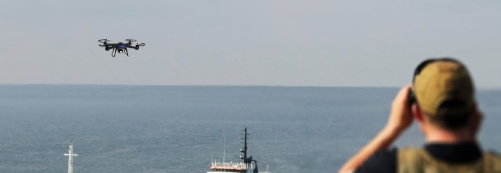

# Drone-vs-Bird Detection Challenge


<div align="center">
  
</div>

The drone-vs-birds challenge aims at meauring and driving progress in the automated detection of small drones in image data.
A focus of the challenge is differentiation between drones and birds, particularly at far distances.
Our dataset is continually increased over consecutive installments of the challenge and made available for reasearch purposes to the community afterwards.  


## News

```
2020-03-30 Despite AVSS 2020 being cancelled, the challenge will go ahead in an online format.
           Further details will be released next week.
2020-03-06 annotations added
2020-03-05 repo created
```

## Challenge 2023 Details

You can find participation details, schedule, and evaluation details at the [Challenge Website](https://wosdetc2023.wordpress.com/drone-vs-bird-detection-challenge/).  
  
Past challenges:
[2022 - at ICIAP Lecce](https://wosdetc2022.wordpress.com/drone-vs-bird-detection-challenge/)
[2021 - at AVSS (virtual)](https://wosdetc2021.wordpress.com/drone-vs-bird-detection-challenge/)
[2020 - virtual](https://wosdetc2020.wordpress.com/drone-vs-bird-detection-challenge/)  
[2019 - at AVSS Taipei](https://wosdetc2019.wordpress.com/challenge/)  
[2017 - at AVSS Lecce](https://wosdetc.wordpress.com/challenge/)  

## Data Request

Please send your request to [wosdetc@googlegroups.com](mailto:wosdetc@googlegroups.com).  
You will be asked to sign a data usage agreement and can then use the data for research purposes.  
## Data

Please send your request to [wosdetc@googlegroups.com](mailto:wosdetc@googlegroups.com).  
You will be asked to sign a data usage agreement and can then use the data for research purposes.  

### Annotations
The annotations are provided as text files with one line per frame in the matching video:  
```
framenum num_objs_in_frame obj1_x_left obj1_y_top obj1_w obj1_h obj1_class ...
```  
If you find problems in the data, feel free to create an [issue](https://github.com/wosdetc/challenge/issues).
